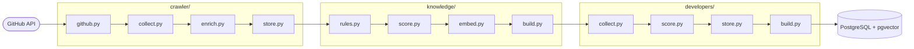
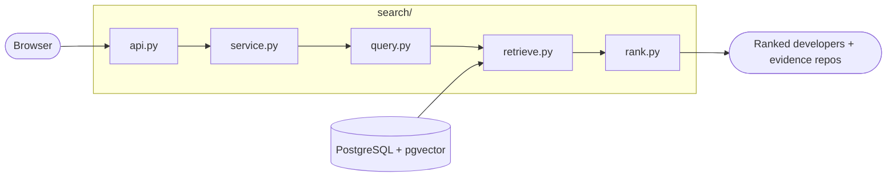

<div align="center">

# rag-atlas

Find engineers who have built RAG systems, ranked by repository.


</div>

## Key features

* **Repo-first**<br/>Search matches RAG repositories against your product description first, then ranks the developers who contributed to them. A developer surfaces because of code they shipped, never because of profile text.
* **Filter by RAG Types**<br/>Pick GraphRAG, Agentic RAG, Self-RAG, Corrective RAG, Hybrid Retrieval or Multimodal RAG to push matching developers up the list, it re-ranks rather than filtering candidates out.

## Architecture

**Build knowledge base**



**User search**



## Status

| Block | What | State |
|---|---|---|
| `crawler/` | seed queries → GitHub search → repository rows + discovery provenance | ✅ |
| `knowledge/` | repository → RAG types, use cases, domains, relevance label, embedding | ✅ |
| `developers/` | relevant repos → contributors → repo↔developer evidence graph | ✅ |
| `search/` | product description → pgvector retrieval → ranked developers (FastAPI) | ✅ |
| `evaluation/` | benchmark queries → Recall@K / Precision@K / MRR | ✅ |
| `app/` | Next.js query + result + evidence UI | ✅ |

## Installation and usage

Clone the repo and start PostgreSQL:

```bash
git clone https://github.com/januaryofmine/rag-atlas
cd rag-atlas
cp .env.example .env          # optionally set GITHUB_TOKEN to lift the rate limit
docker compose up -d postgres
```

Create the schema and build the dataset offline:

```bash
docker compose run --rm backend rag-atlas-db init
docker compose run --rm backend rag-atlas-crawler run --max-repos 50
docker compose run --rm backend rag-atlas-knowledge run
docker compose run --rm backend rag-atlas-developers run
```

Serve the API and the UI, then open `http://localhost:3000`:

```bash
docker compose up --build api app
```

Query the API directly:

```bash
curl -X POST http://localhost:8000/v1/search \
  -H 'content-type: application/json' \
  -d '{"product_description": "legal contract review and question answering over internal documents",
       "rag_types": ["GRAPH_RAG"], "limit": 10}'
```

Score the ranking against the benchmark, or run the unit tests:

```bash
docker compose run --rm -v "$PWD/evaluation/data:/data:ro" \
  backend rag-atlas-evaluate run --file /data/queries.example.json
pytest -q
```

Requirements live in [`key-features.md`](key-features.md), the reasoning path in [`docs/`](docs/), and the step-by-step checklist in [`todolist.md`](todolist.md).
